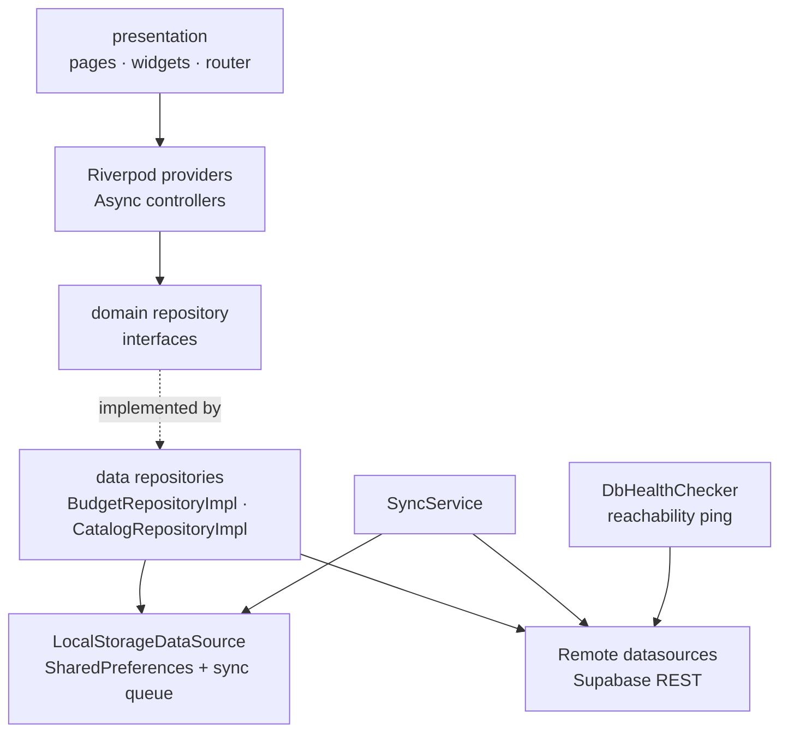
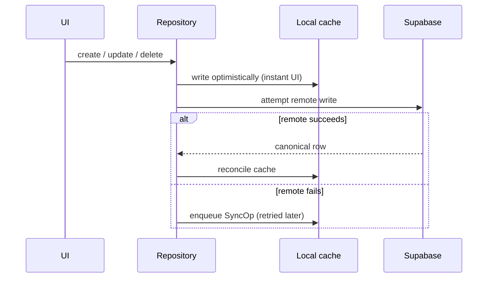

# BOX JM

**Offline-first Flutter app for building, pricing, and sharing automotive-detailing service quotes.**

[](#license)
[](https://dart.dev)
[](#tech-stack)

BOX JM is a mobile quoting tool for automotive detailing / aesthetics shops. A shop owner assembles a quote from a service catalog, picks the vehicle size (which applies a price multiplier), fine-tunes prices per line, and sends the finished quote to the client either as a ready-to-paste WhatsApp/SMS message or as a branded A4 PDF.

It is built for the real setting where these quotes are made — a garage with unreliable signal. Every read is served instantly from a local cache and every write is optimistic: it lands in local storage first and a durable sync queue reconciles with the cloud once the backend is actually reachable again.

The interface is in Brazilian Portuguese and money is formatted in BRL (R$).

## Features

- **Quote lifecycle** — create, edit, duplicate, and delete quotes; move each one through a status flow of `draft → sent → approved → completed`.
- **Vehicle-size pricing** — every service base price is multiplied by a vehicle factor: small `×1.0`, medium `×1.2`, large `×1.5`, SUV `×1.7`, truck `×2.0`.
- **Per-quote price overrides** — override the charged price of any line item for a specific quote without mutating the shared catalog.
- **"Set total" back-solving** — type a target grand total and the line prices are rescaled proportionally to match it.
- **Service catalog** — full CRUD over services grouped into four categories (exterior, interior, protection, detailing); the database ships seeded with 11 common services.
- **Home dashboard** — approved-vs-pending value gauges, live search by client or vehicle, status filter chips with per-status counts, sorting (most recent / highest value / client A–Z), and date bucketing (today / yesterday / this week / older).
- **Sharing** — export a quote as formatted WhatsApp/SMS text or as a generated PDF (branded header, itemized table, totals block, notes).
- **Offline-first sync** — local cache in `SharedPreferences`, optimistic writes, and a persistent operation queue with per-op retry and a max-attempts poison-op discard so one bad payload never blocks the queue forever.
- **True backend-reachability detection** — connectivity is derived from an actual lightweight query against Supabase (with a short timeout), not merely from the presence of a network interface, so captive portals and a down backend are correctly treated as offline.

## Tech Stack

| Area | Choice | Version |
|------|--------|---------|
| Framework | Flutter | `>= 3.22.0` |
| Language | Dart SDK | `>= 3.3.0 < 4.0.0` |
| State management | `flutter_riverpod` | `^2.5.1` |
| Routing | `go_router` | `^14.2.0` |
| Backend (Postgres) | `supabase_flutter` | `^2.5.6` |
| Local cache | `shared_preferences` | `^2.2.3` |
| Connectivity | `connectivity_plus` | `^6.0.3` |
| PDF | `pdf` + `printing` | `^3.11.1` / `^5.13.2` |
| Sharing | `share_plus` | `^11.1.0` |
| Config | `flutter_dotenv` | `^5.1.0` |
| Misc | `uuid`, `intl` | `^4.4.0`, `^0.19.0` |
| Lints | `flutter_lints` | `^4.0.0` |

Targets built: **Android** and **iOS** (mobile only — no web/desktop runners are committed).

## Architecture

The app follows a clean-architecture split into three layers. The `domain` layer holds plain entities and abstract repository contracts and depends on nothing Flutter-specific; `data` implements those contracts over a Supabase remote and a local cache; `presentation` wires everything through Riverpod providers.



Every mutating repository call takes the same offline-safe path:



When connectivity is restored, `SyncService.syncAll()` drains the queued operations (dropping any that exceed the retry ceiling) and refreshes the local cache from the remote.

## Getting Started

### Prerequisites

- Flutter SDK `>= 3.22` (bundles Dart `>= 3.3`) — verify with `flutter doctor`.
- An Android and/or iOS toolchain.
- A [Supabase](https://supabase.com) project (free tier is enough).

### 1. Provision the database

Open your Supabase project's SQL editor and run [`schema.sql`](schema.sql). It is idempotent and creates the `services` and `budgets` tables, their indexes and row-level-security policies, and seeds the default service catalog.

### 2. Configure credentials

The app loads its Supabase credentials from a `.env` file at the repository root, which is also declared as a bundled asset — **the app will not build or launch without it.** Create it:

```env
SUPABASE_URL=https://YOUR_PROJECT.supabase.co
SUPABASE_ANON_KEY=your-anon-key
```

### 3. Install and run

```bash
flutter pub get
flutter run
```

### 4. Build a release

```bash
flutter build apk     # Android
flutter build ios     # iOS (requires macOS + Xcode)
```

### Tests

```bash
flutter test
```

> **Note:** the tests under `test/integration/` are *integration* tests that exercise the Supabase datasources against a **live, reachable backend**. They create and clean up their own rows over the network and will fail without connectivity and valid credentials. There is no offline unit-test suite and no CI configured in this repository.

## Project Structure

```text
lib/
├── core/                  # Cross-cutting concerns (no feature logic)
│   ├── constants/         # Vehicle multipliers, category labels
│   ├── network/           # db_health.dart — Supabase reachability ping
│   ├── theme/             # Design tokens: colors, spacing, shadows, text
│   └── utils/             # currency, budget calc, PDF builder, logger, id
├── domain/                # Framework-free core
│   ├── entities/          # Budget, ServiceItem, VehicleType
│   └── repositories/      # Abstract repository contracts
├── data/                  # Implementations of the domain contracts
│   ├── datasources/       # Supabase remote + SharedPreferences local
│   └── repositories/      # Repo impls + SyncService (offline queue)
├── presentation/          # UI layer
│   ├── pages/             # home, new/edit budget, detail, catalog, shell
│   ├── providers/         # Riverpod providers & async controllers
│   ├── widgets/           # Reusable widgets
│   └── router.dart        # go_router configuration
└── main.dart              # Bootstrap: dotenv → Supabase.initialize → ProviderScope

schema.sql                 # Supabase schema + RLS + catalog seed
test/integration/          # Integration tests against a live Supabase backend
tool/generate_icons.py     # Launcher/splash icon generation from the wordmark
```

## Status & Limitations

This is an early-stage, single-tenant project.

- **No authentication.** The schema's RLS policy grants full read/write access to the `anon` role, which is appropriate for one shop on one device but not for multi-user or multi-tenant use.
- **Localized to pt-BR.** UI copy is Portuguese and currency is hardcoded to BRL; there is no i18n layer yet.
- **Mobile only.** Android and iOS runners are committed; web and desktop are not configured.
- **Integration tests, not unit tests.** Test coverage validates the remote datasources against a real backend; there is no mocked/offline suite and no CI pipeline.

## License

Released under the [MIT License](LICENSE).
